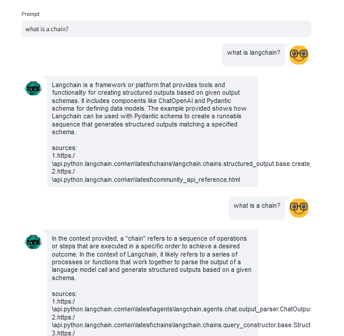

# ASISTENTE DE DOCUMENTACION
## Video Funcionamiento
[Link al video](https://youtu.be/RfofYedIpxI)
## Que hace este proyecto?
Lo que hace es primero almacenar toda la data del documento en una base vectorial en Pinecone.
Despues se le hace una consulta al LLM y en base a los chumks relacionados con la informacion que se obtuvo , los consume y da una respuesta con tu historial y solo lo que se encuentre en la base vectorial

## Funcionamiento


## Ejecucion
Dirigete a la carpeta del proyecto
```
cd ASISTENTE_DOCUMENTACION
``` 

Activa el entorno con
```
.\asistente\Scripts\activate
``` 

instalar las librerias con
```
pip install -r requirements.txt
``` 
Ahora ejecuta el main usando streamlit
```
streamlit run main.py
``` 


